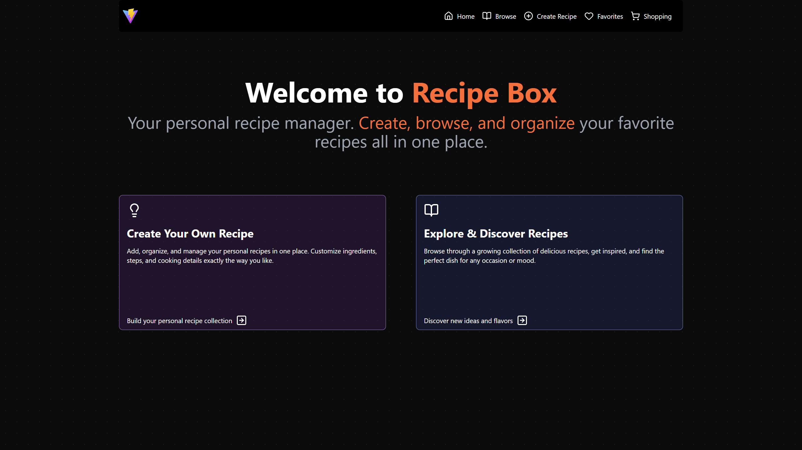
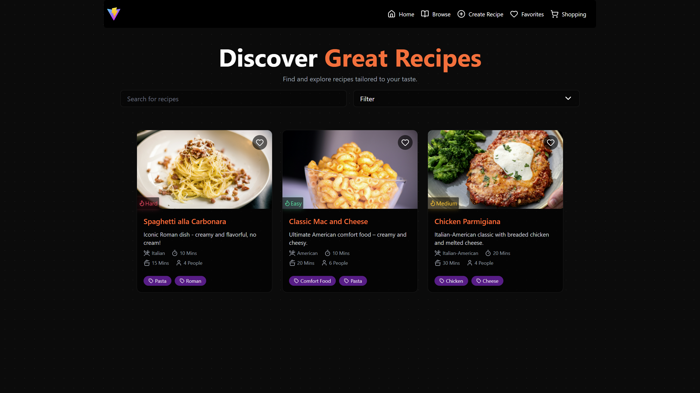
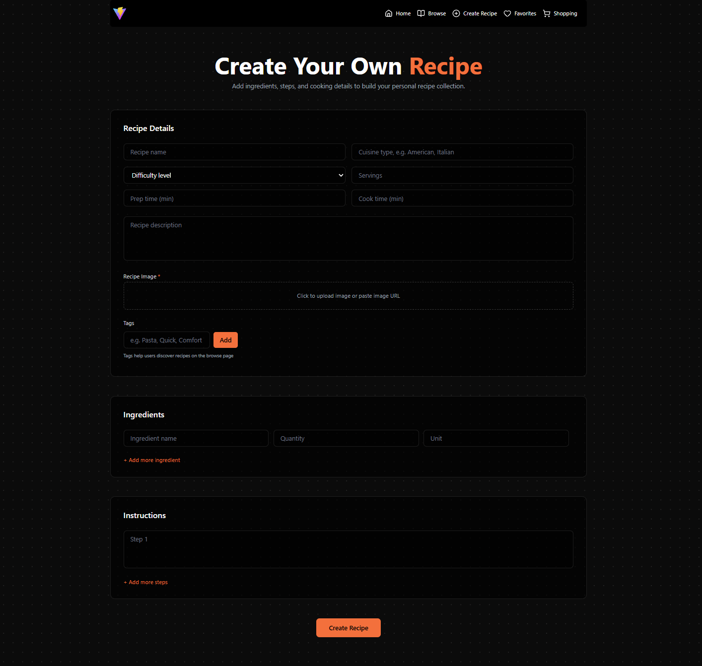
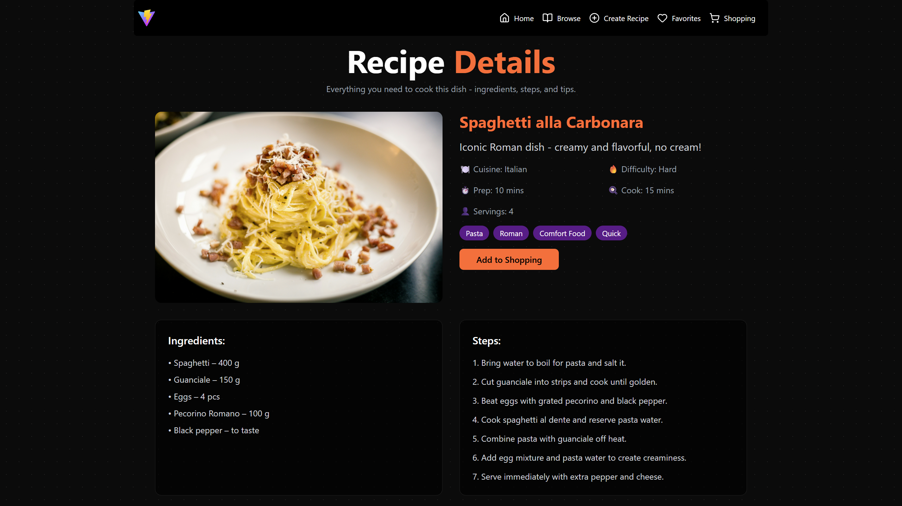
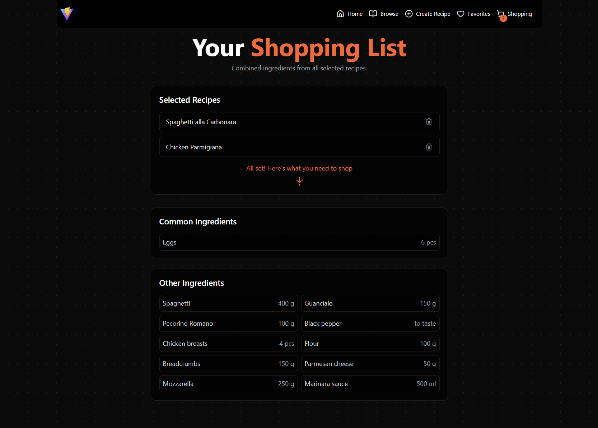

# Recipe Box

A personal recipe manager built with React + TypeScript.

Users can create recipes, browse them, mark favorites, and generate a shopping list that combines ingredients from multiple recipes.

The main goal of this project is **good UX and clean design**, especially on mobile devices (people usually cook using phones).

---

## Screenshots / GIFs







---

## Quick Start

### Run locally

```bash
npm install
npm run dev

```

### Docker (Required)

Build image:

```bash
docker build -t recipe-box .

```

Run container:

```bash
docker run -p 3000:3000 recipe-box

```

Open in browser:

```
http://localhost:3000
```

---

## Live Demo

[https://recipe-box-sand.vercel.app/](https://recipe-box-sand.vercel.app/)

---

## Tech Stack (and why I chose it)

### React + TypeScript

Used TypeScript to avoid bugs, keep data structures clear, and make the code easier to maintain.

### React Router

Simple and clean routing for pages like browse, recipe details, favorites, and shopping list.

### Tailwind CSS

Helps build UI quickly while keeping spacing, colors, and layout consistent.

### localStorage

Stores recipe data, favorites, and shopping list selection.

### IndexedDB

Used for storing uploaded images (large files).

---

## Data Persistence (Important)

### Why localStorage + IndexedDB?

Initially, images were stored in localStorage as Base64 strings.
This caused **quota exceeded errors** because localStorage has a small limit (~5MB).

Final solution:

* **localStorage**
  Stores recipe data, favorites, shopping list flags.
* **IndexedDB**
  Stores uploaded images as files/blobs.
* Recipes store only an `imageId`, not the image itself.

Seed recipes use image URLs (Unsplash) and do not require IndexedDB.

This prevents crashes and keeps the app stable.

---

## Seed Recipes (Required)

The app includes 3 pre-filled recipes so it feels alive on first load:

* Spaghetti alla Carbonara
* Classic Mac and Cheese
* Chicken Parmigiana

How it works:

* On first load, the app checks localStorage
* If no recipes exist, seed recipes are inserted once
* User data is never overwritten

---

## Features Implemented

### 1. Recipe Management

* Create recipes with:

  * name, description, cuisine, difficulty
  * prep time, cook time, servings
  * image upload
  * tags
* Add ingredients with quantity and unit
* Add step-by-step instructions
* Mark recipes as favorites
* Select recipes for shopping list

---

### 2. Discovery & Navigation

* Browse recipes in card layout
* Search updates while typing (debounced)
* Basic filters:

  * difficulty
  * cook time
  * servings
* Favorites page
* Empty states (example: no recipes found)
* Skeleton loaders for recipe cards

---

### 3. Reading Experience (UX Focus)

Recipe detail page focuses on readability:

* Clear layout: image, details, ingredients, steps
* Large text and spacing
* Strong contrast (dark theme)

Not implemented (future improvements):

* Check-off ingredients/steps
* Auto-scaling quantities by servings
* Timers

---

### 4. Shopping List Generator

* Recipes can be added to shopping list
* Shopping list page:

  * shows selected recipes
  * combines ingredients
  * sums common items (eggs 4 + eggs 2 = eggs 6)
  * updates automatically when recipes are removed

---

## UX Decisions

* **Simple flow:** easy to add a recipe without confusion
* **Mobile-first:** layout works well on small screens
* **Clear feedback:** empty states and skeleton loaders
* **Minimal UI:** focus on content, not decoration

---

## Challenges Faced

### 1. Image storage issues

* Base64 images in localStorage caused crashes
* Solved by moving images to IndexedDB

### 2. Invalid localStorage data

* Some entries caused runtime errors
* Added validation when loading recipes

### 3. Lighthouse performance confusion

* Dev mode scores were low
* Tested production build instead
* Performance improved after lazy loading

---

## Performance Notes

* Route-based code splitting
* Lazy loading images
* Skeleton loading states

Unsplash images can still be large
(can be improved using optimized URLs like `?w=800&auto=format&q=70`).

---

## Accessibility (A11y)

* Proper labels for inputs
* `aria-label` for icon-only buttons
* Keyboard-friendly interactions

---

## Future Improvements

1. Check-off ingredients and steps
2. Change servings and auto-update quantities
3. Cooking timers
4. Ingredient categories in shopping list
5. Toast notifications
6. Edit/delete recipe UI
7. Adding slider carousel to the home page below the primary action buttons

---

## Assumptions

* Personal recipe app (no authentication)
* Data stored locally in browser
* No backend
* Seed recipes improve first-time experience

---

## Time Spent

~29 hours total

* UI & styling: ~30%
* Core logic: ~40%
* Debugging & improvements: ~30%

---

## Folder Structure (High-level)

```
src/pages        – all pages
src/components   – reusable UI components
src/data         – types + seed recipes
src/utils        – storage helpers
src/hooks        – reusable hooks
```

---

## Submission

* Code pushed to GitHub (public repo)
* Docker setup included and tested
* Seed recipes included
* Live demo deployed

```

